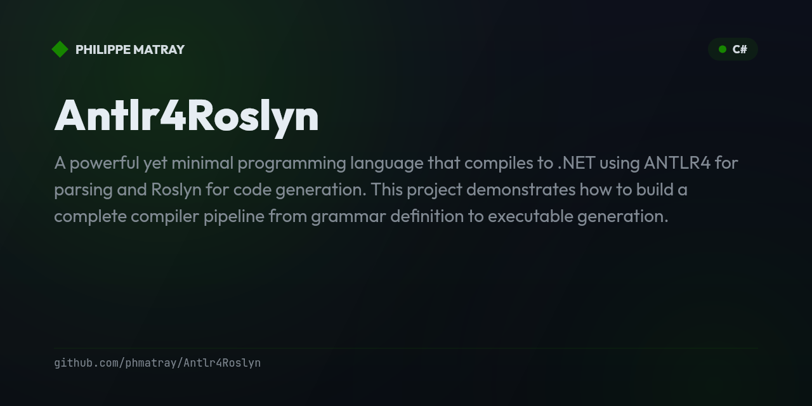

# Simple Programming Language Compiler

A powerful yet minimal programming language that compiles to .NET using ANTLR4 for parsing and Roslyn for code generation. This project demonstrates how to build a complete compiler pipeline from grammar definition to executable generation.

## 🚀 Language Features

**Simple** is a clean, expressive programming language with a small but powerful set of features:

- **✅ Variables & Assignment** - `let x = 42; x = x + 10;`
- **✅ Rich Expressions** - Arithmetic, comparisons, boolean logic with proper precedence
- **✅ Control Flow** - `if/else` statements, `while` loops
- **✅ Multiple Data Types** - Integers, floats, strings, booleans, arrays
- **✅ Block Statements** - Proper scoping with `{}`
- **✅ Arrays** - Array literals `[1, 2, 3, 4, 5]`
- **🔧 Functions** - Local functions with expression and block syntax
- **🔧 Lambdas** - Anonymous functions with type inference

## 📋 Quick Start

```bash
# Clone and run
git clone <repository-url>
cd Antlr4Roslyn
dotnet run --project DotnetCompiler
```

## 🎯 Language Syntax

### Variables and Assignment
```javascript
let x = 42;
let name = "Hello World";
let flag = true;
x = x + 10;
```

### Control Flow
```javascript
// Conditionals
if (score >= 90) {
    let grade = "A";
    grade;
} else {
    let grade = "B";
    grade;
}

// Loops
let sum = 0;
let i = 1;
while (i <= 5) {
    sum = sum + i;
    i = i + 1;
}
```

### Expressions
```javascript
// Arithmetic with precedence
3 + 5 * 2;              // → 13

// Boolean logic
(x > 5 && x < 10) || x == 0;

// Comparisons
a >= b && b != 0;
```

### Arrays
```javascript
let numbers = [1, 2, 3, 4, 5];
let mixed = [42, "hello", true];
```

### Functions (In Development)
```javascript
// Expression functions
fn add(a, b) => a + b;

// Block functions  
fn factorial(n) {
    if (n <= 1) {
        return 1;
    } else {
        return n * factorial(n - 1);
    }
}
```

## 🏗️ Architecture

The compiler uses a clean multi-stage pipeline:

```
Source Code → ANTLR4 Parser → AST Visitor → Roslyn Syntax Tree → C# Code → .NET Executable
```

### Core Components

| Component | Purpose |
|-----------|---------|
| **`Simple.g4`** | ANTLR4 grammar defining language syntax |
| **`Compiler.cs`** | Main orchestrator coordinating all compilation stages |
| **`AntlrToRoslynVisitor.cs`** | Converts ANTLR parse tree to Roslyn syntax nodes |
| **`ProgramGenerator.cs`** | Wraps expressions in complete C# program structure |
| **`CompilationService.cs`** | Compiles and executes generated C# code |

### Compilation Pipeline

1. **Lexical Analysis**: ANTLR4 tokenizes source code
2. **Syntax Analysis**: Parser builds concrete syntax tree
3. **Semantic Analysis**: Visitor transforms to Roslyn AST
4. **Code Generation**: Roslyn generates C# source code
5. **Compilation**: .NET compiler produces executable bytecode
6. **Execution**: Runtime executes the compiled program

## 🎮 Example Output

Running the demo shows the language in action:

```
=== Enhanced Language Demo ===

1. Arithmetic & Operator Precedence:
Code: 3 + 5 * 2;
Result: 13

2. Variables and Assignment:
Code: let x = 10;
    let y = 20;
    x = x + y;
    x;
Result: 30

3. Boolean Logic:
Code: let a = 15;
    let b = 10;
    a > b && b > 5;
Result: True

4. Conditional Logic:
Code: let score = 95;
    if (score >= 90) {
        let grade = "A";
        grade;
    } else {
        let grade = "B";
        grade;
    }
Result: A

5. While Loops (Sum 1-5):
Code: let sum = 0;
    let i = 1;
    while (i <= 5) {
        sum = sum + i;
        i = i + 1;
    }
    sum;
Result: 15
```

## 🛠️ Development

### Prerequisites
- **.NET SDK 8.0+**
- **ANTLR4 Runtime** (included via NuGet)

### Building
```bash
git clone <repository-url>
cd Antlr4Roslyn
dotnet build
```

### Running Tests
```bash
dotnet run --project DotnetCompiler
```

### Project Structure
```
Antlr4Roslyn/
├── Antlr4Roslyn/              # Core compiler library
│   ├── Grammar/
│   │   └── Simple.g4          # Language grammar
│   └── Services/
│       ├── Compiler.cs        # Main compiler orchestrator
│       ├── AntlrToRoslynVisitor.cs  # AST transformation
│       ├── ProgramGenerator.cs     # C# code generation
│       └── CompilationService.cs   # .NET compilation
└── DotnetCompiler/            # Demo application
    └── Program.cs             # Language showcase & examples
```

## 🚧 Roadmap

### Completed ✅
- ✅ **Core Language** - Variables, expressions, control flow
- ✅ **Rich Type System** - int, float, string, bool, arrays
- ✅ **Operator Precedence** - Proper mathematical precedence
- ✅ **Control Structures** - if/else, while loops
- ✅ **Block Scoping** - Nested statement blocks
- ✅ **ANTLR4 Integration** - Complete grammar definition
- ✅ **Roslyn Integration** - C# code generation
- ✅ **Demo Application** - Comprehensive language showcase

### In Progress 🔧
- 🔧 **Function Definitions** - Local function syntax `fn name() {}`
- 🔧 **Lambda Expressions** - Anonymous functions `|x| => x * 2`
- 🔧 **Advanced Arrays** - Indexing and iteration
- 🔧 **Better Error Messages** - Detailed compilation errors

### Future Enhancements 🎯
- 🎯 **For Loops** - `for (i in 1..10)` syntax
- 🎯 **String Interpolation** - `"Hello {name}"`
- 🎯 **Pattern Matching** - `match` expressions
- 🎯 **Modules/Imports** - Code organization
- 🎯 **Standard Library** - Built-in functions
- 🎯 **REPL Mode** - Interactive interpreter
- 🎯 **IDE Support** - Syntax highlighting, IntelliSense

## 🤝 Contributing

Contributions welcome! Areas where help is needed:

1. **Grammar Extensions** - Adding new language features
2. **Error Handling** - Better error messages and recovery
3. **Standard Library** - Built-in functions and utilities
4. **Documentation** - Examples and tutorials
5. **Testing** - Unit tests and integration tests

### Getting Started
1. Fork the repository
2. Create a feature branch
3. Add tests for new features
4. Submit a pull request

## 📄 License

This project is open-source and available under the **MIT License**.

## 🙏 Acknowledgments

- **ANTLR4** - Powerful parser generator
- **Roslyn** - .NET compiler platform
- **Community** - Thanks to all contributors!

